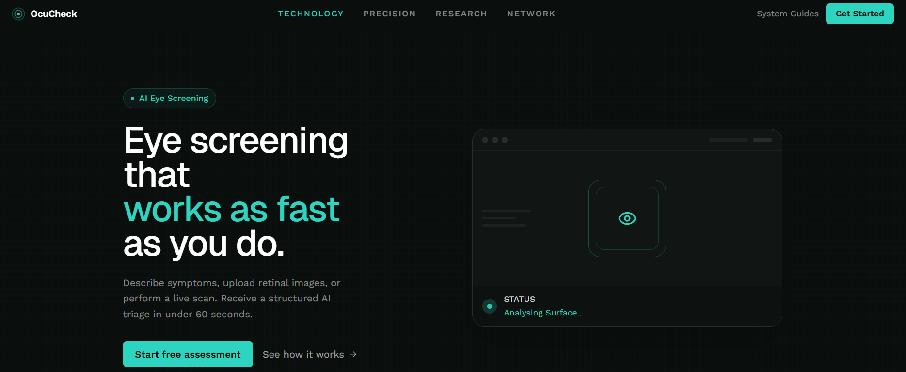
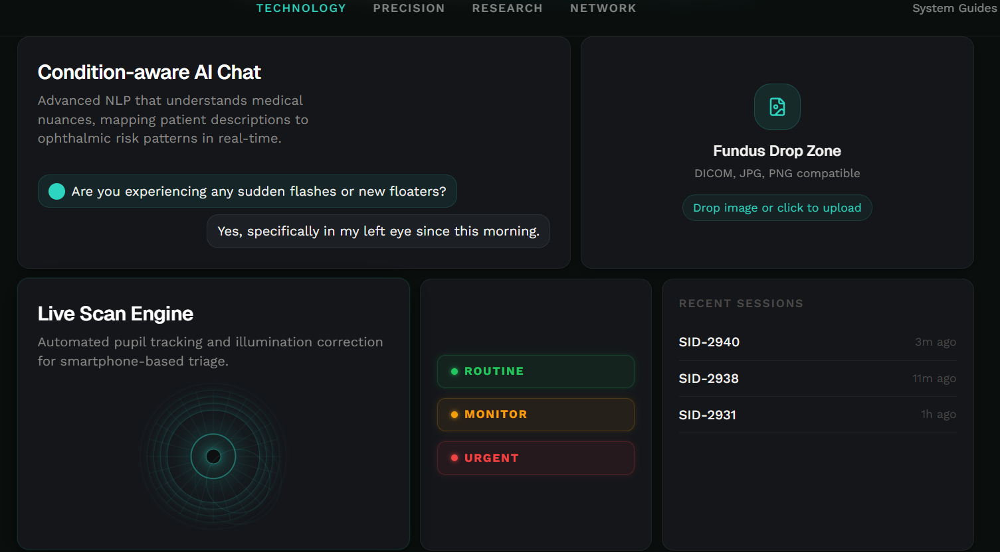
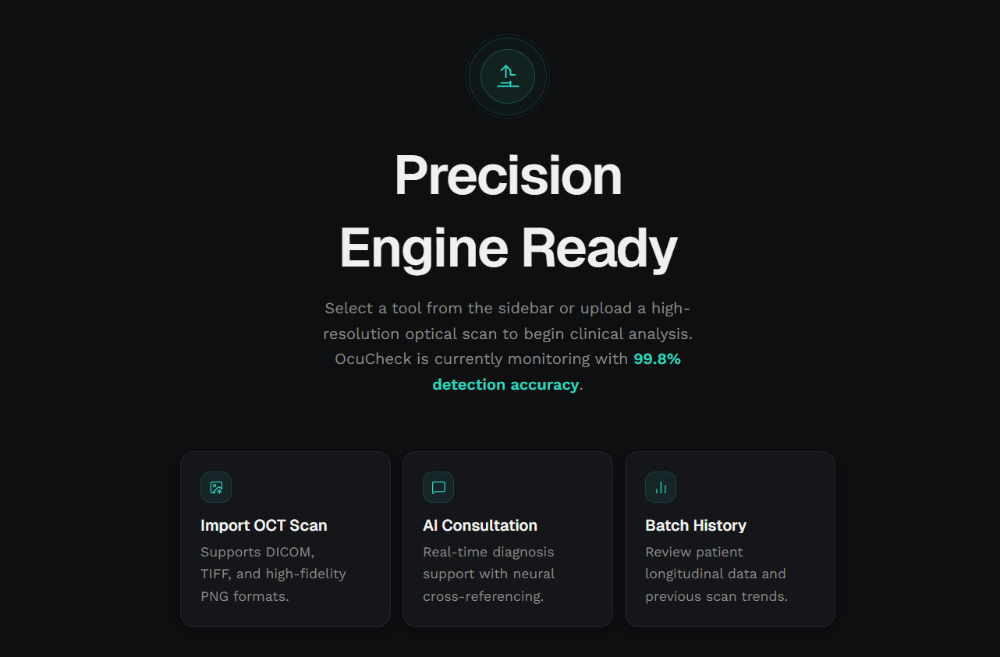
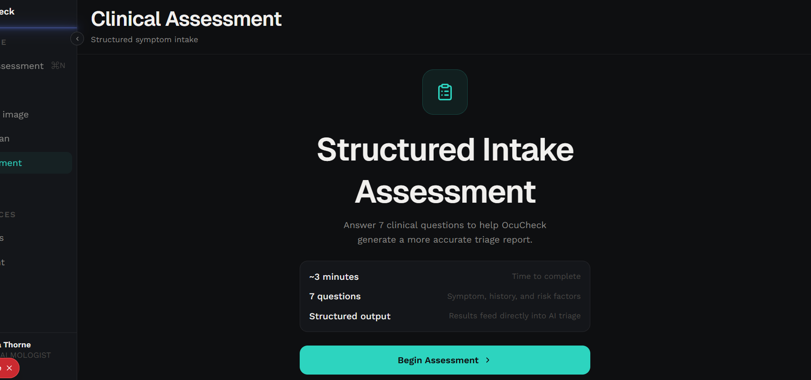
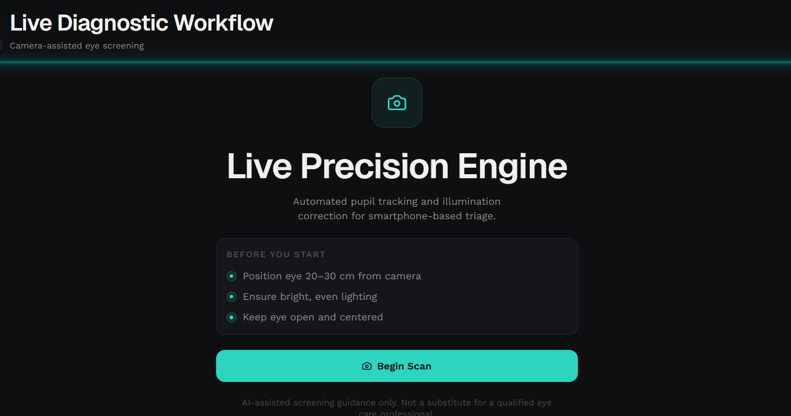
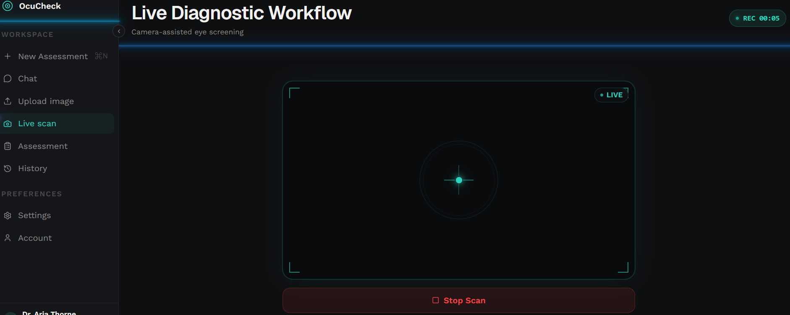
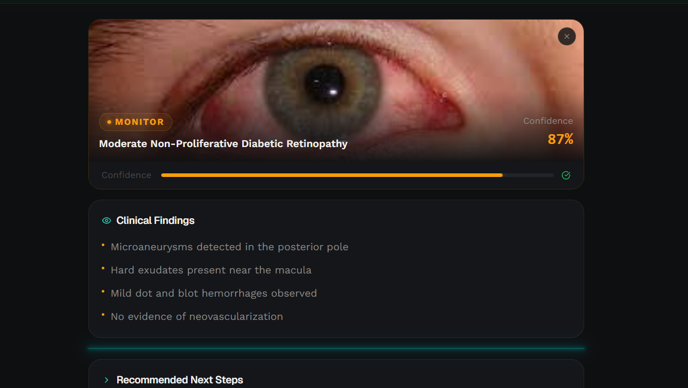
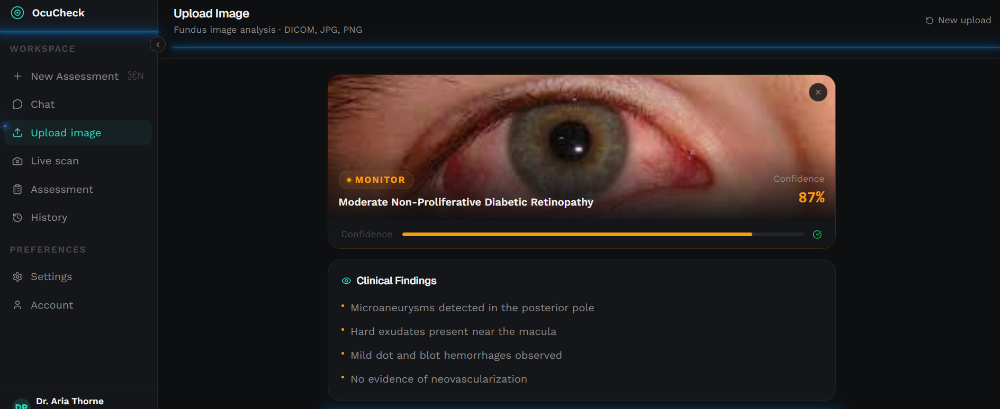
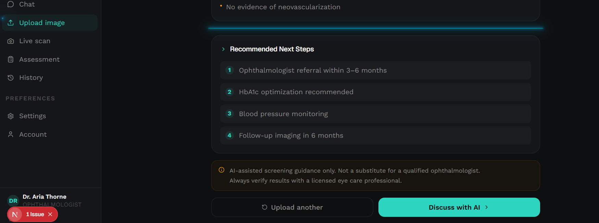

# OcuCheck — AI Eye Screening Platform

> AI-assisted eye disease pre-screening workflow. Describe symptoms, upload a fundus image, or run a live scan. Receive structured triage results in under 60 seconds.


<br />

---

## 📸 Screenshots

### 🏠 Landing Page


<br />



<br />

### 🖥️ Workspace


<br />

### 💬 Assessment


<br />

### 📷 Live Scan


<br />



<br />

### 🖼️ Upload Image


<br />



<br />



<br />

---

## 🧠 What is OcuCheck?

OcuCheck is a full-stack AI-powered eye disease pre-screening platform designed for fast, first-level clinical assessment. It combines a **conversational AI interface**, **fundus image analysis**, and **live camera scanning** into a single structured workspace — outputting triage-level results categorized as **Routine**, **Monitor**, **Urgent**, or **Emergency**.

> ⚠️ OcuCheck is a pre-screening triage tool. It does **not** provide medical diagnoses. Always consult a licensed ophthalmologist for any medical concerns.

<br />

---

## ✨ Features

- 🤖 **Condition-aware AI Chat** — NLP that understands ophthalmic symptoms and maps them to clinical risk patterns in real-time
- 🖼️ **Fundus Image Upload** — DICOM, JPG, PNG compatible. Drag-and-drop with AI-assisted surface analysis
- 📷 **Live Scan Engine** — Camera-based eye scan with automated pupil tracking and illumination correction
- 📋 **Structured Assessment** — 7-step clinical intake wizard covering symptoms, history, and risk factors
- 🎯 **Triage Classification** — Results ranked: Routine / Monitor / Urgent / Emergency with glow-coded badges
- 📁 **Session History** — Past assessments organized by session ID and timestamp
- 🌐 **Marketing Landing Page** — Feature bento grid, how-it-works steps, and clinical trust section
- 🎨 **RGB Glow UI** — Animated teal→blue→green cycling glow lines, scan pulse rings, premium dark medtech theme

<br />

---

## 🛠️ Tech Stack

### Frontend
| Technology | Purpose |
|---|---|
| [Next.js 15](https://nextjs.org) App Router | Full-stack React framework |
| TypeScript | Type safety throughout |
| Tailwind CSS v4 | Utility-first styling with custom tokens |
| Stream.io Video SDK | Live camera session management |
| Zustand | Client-side state management |
| TanStack Query | Server state & data fetching |
| Lucide React | Icon system |

### Backend
| Technology | Purpose |
|---|---|
| FastAPI (Python) | REST API server |
| LangGraph | AI agent workflow orchestration |
| Anthropic Claude | Conversational AI & clinical NLP |
| PyTorch / TensorFlow | Deep learning model inference |

### AI / ML Models
| Model | Condition Detected |
|---|---|
| EfficientNet-B4 | Diabetic Retinopathy (5-class grading) |
| U-Net + ResNet | Glaucoma segmentation (optic disc/cup ratio) |
| Custom CNN | Cataract binary classification |

<br />

---

## 🚀 Getting Started

### Prerequisites

- Node.js 18+
- Python 3.10+
- [Stream.io](https://getstream.io) account (for live scan feature)
- [Anthropic](https://anthropic.com) API key

<br />

### 1. Clone the repository

```bash
git clone https://github.com/your-username/ocucheck.git
cd ocucheck
